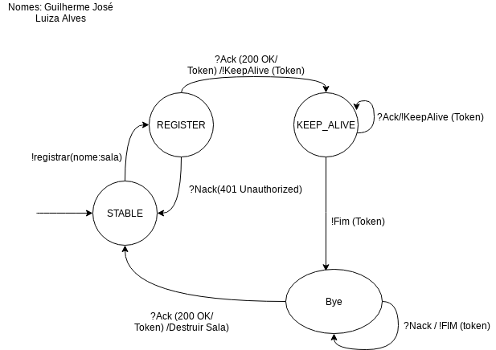

**Instituto Federal de Santa Catarina**

# Sistemas multimidia

Projeto da disciplina de Sistemas multimidia (SMU29009) do curso de Engenharia de Telecomunicações do Instituto Federal de Santa Catarina - câmpus São José, realizada em 2022.1.

##### Equipe:
- [Guilherme José Salles Vieira](https://github.com/guilherme-jsv)
- [Luiza Alves da Silva](https://github.com/luizaalves)

## Sistemas multimidia

